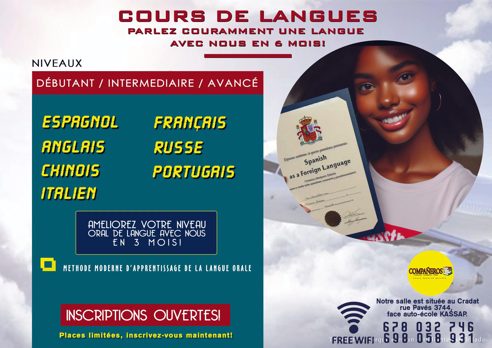
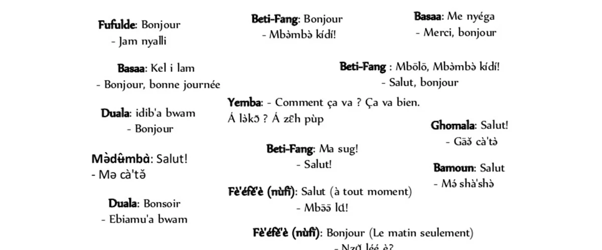
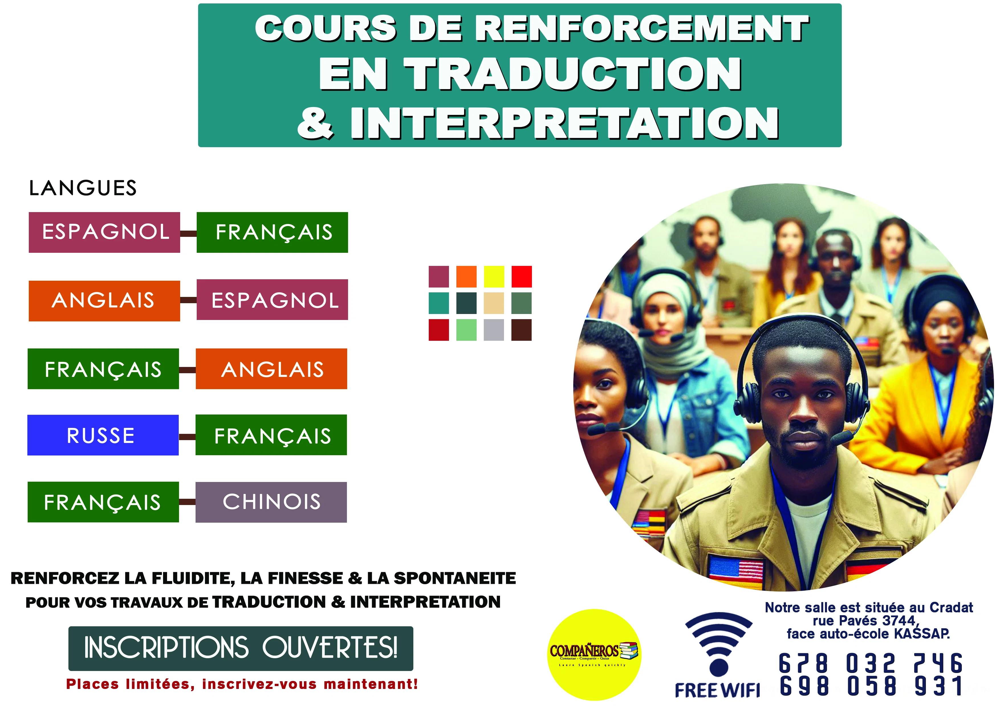

# COURS DE LANGUES NATIONALES & INTERNATIONALES - Compañeros-Jbk E...

Source: https://686343fd3dffb.site123.me/services-compa%C3%91eros/cours-de-langues-nationales-internationales

Description: Etudiez avec nous, toutes les langues nationales du Cameroun et une dizaine de langues internationales.

## Structure de contenu

## COURS DE LANGUES NATIONALES & INTERNATIONALES

## Textes utiles

- SERVICES COMPAÑEROS
- COURS DE LANGUES NATIONALES & INTERNATIONALES
- LANGUES NATIONALES
- En tenant compte de la grande diversité culturelle au camerounaise, du pluralisme linguistique et du vivre ensemble, plusieurs foyers se retrouvent généralement dans une situation où les deux parents sont de différentes ethnies au Cameroun et n’ont que le français ou l’anglais comme langue de communication en famille. Ce qui rend difficile, voire casi impossible la transmission de l’héritage culturel linguistique aux enfants.
- C’est pourquoi Compañeros propose des cours de langues nationales permettant aux enfants de parler couramment n’importe quelle langue parmi plus de 250 parlées au Cameroun.
- NB: Nos cours de langues nationales sont à la fois oraux et écrits. Cependant, nos objectifs pédagogiques priorisent beaucoup plus le langage oral. Car il est primordial pour d'emmener l’élève à parler couramment sa langue maternelle en 3 ou 6 mois au plus.
- Nous disposons de plus de 500 enseignants qualifiés à travers le pays et nos cours sont dispensés sous trois formes:
- * COURS DE LANGUES NATIONALES À DOMICILE Indépendamment de votre ville de résidence, Nos enseignant se déplaceront pour travailler avec vous chez vous, pendant les horaires qui vous conviennent.
- * COURS DE LANGUES NATIONALES EN PR ÉSENTIEL L’apprenant devra se rapprocher de notre centre pour recevoir des cours. COURS DE LANGUES NATIONALES EN LIGNE Avec nous, vous pouvez également solliciter des cours de langues nationales en ligne, selon votre préférence.
- LANGUES INTERNATIONALES
- Nous proposons des cours de langues en présentiel dans notre centre et des cours en ligne. Nos langues dispensées sont de préférence les plus parlées et les plus importantes en matière de business international. Il s’agit précisément des langues suivantes:
- Anglais
- Espagnol
- Chinois
- Français
- Russe
- Portugais
- Italien
- COURS DE RENFORCEMENT EN TRADUCTION & INTERPRETATION
- Pour les étudiants de traduction, nous proposons des cours de renforcement basés sur les travaux pratiques de traductions et des simulations pratiques d’interprétations avec des mises en scènes des situations de la vie professionnelle d’un traducteur-interprète.
- CAMPS DE VACANCES Dans notre centre, nous organisons également des camps de vacances pour permettre aux enfants de s'amuser en parlant leurs langues maternelles entre eux. C'est à la fois une période d'immersion linguistique et d'apprentissage d'un outil musical (Piano, guitare, flute...)
- +237-678 032 746 * 698 058 931 * 698 329 535
- jbkfilms2014@gmail.com
- https://www.google.com/search?client=firefox-b-d&q=companeros%2FJbkfilms+maps
- (Carrefour Cradat - Rue pavés 3744, en face de l'auto école Kassap)

## Images liées

Fichier: ./images/142-2000-68655cae0a55c-296f35af.jpg

Fichier: ./images/135-normal-687a11164fb27-b25fb4e6.jpg

Fichier: ./images/136-normal-6868931fc2213-899bb975.jpg

Fichier: ./images/137-normal-687a14843faea-8a116e4e.jpg

Fichier: ./images/138-normal-68655d153c28c-33c2a2a5.jpg

Fichier: ./images/139-normal-687a1297d7217-bc0be57a.jpg

Fichier: ./images/140-normal-687a12bd462c6-5a76c9c4.jpg

Fichier: ./images/141-800-68655cae0a55c-f5d44b86.jpg

Fichier: ./images/15-400-687a30a0db30b-e224f5c8.jpg

Fichier: ./images/32-400-686431bb817da-a01bf517.jpg

Fichier: ./images/34-400-68655c35efc24-98e8119b.jpg

## Liens et appels à l'action

- Compañeros-Jbk Empire: https://686343fd3dffb.site123.me/
- SERVICES COMPAÑEROS: https://686343fd3dffb.site123.me/services-compa%C3%91eros
- Langues nationales: https://686343fd3dffb.site123.me/services-compa%C3%91eros/tag/langues-nationales
- Beti: https://686343fd3dffb.site123.me/services-compa%C3%91eros/tag/beti
- Bulu: https://686343fd3dffb.site123.me/services-compa%C3%91eros/tag/bulu
- Ewondo: https://686343fd3dffb.site123.me/services-compa%C3%91eros/tag/ewondo
- Bassa: https://686343fd3dffb.site123.me/services-compa%C3%91eros/tag/bassa
- Ghomala: https://686343fd3dffb.site123.me/services-compa%C3%91eros/tag/ghomala
- Bamileke: https://686343fd3dffb.site123.me/services-compa%C3%91eros/tag/bamileke
- Fufuldé: https://686343fd3dffb.site123.me/services-compa%C3%91eros/tag/fufuld%C3%A9
- SUIVIS DE VOYAGES: https://686343fd3dffb.site123.me/services-compa%C3%91eros/suivis-de-voyages
- PREPARATION CONCOURS: https://686343fd3dffb.site123.me/services-compa%C3%91eros/preparation-concours
- SERVICE DE TRADUCTION & INTERPRETATION: https://686343fd3dffb.site123.me/services-compa%C3%91eros/service-de-traduction-interpretation
- +237-678 032 746 * 698 058 931 * 698 329 535: https://wa.me/237678032746698058931698329535
- https://www.google.com/search?client=firefox-b-d&q=companeros%2FJbkfilms+maps: http://maps.google.com/?q=https%3A%2F%2Fwww.google.com%2Fsearch%3Fclient%3Dfirefox-b-d%26amp%3Bq%3Dcompaneros%252FJbkfilms%2Bmaps
- (Carrefour Cradat - Rue pavés 3744, en face de l'auto école Kassap): http://maps.google.com/?q=https%3A%2F%2Fwww.google.com%2Fsearch%3Fclient%3Dfirefox-b-d%26amp%3Bq%3Dcompaneros%252FJbkfilms%2Bmaps
