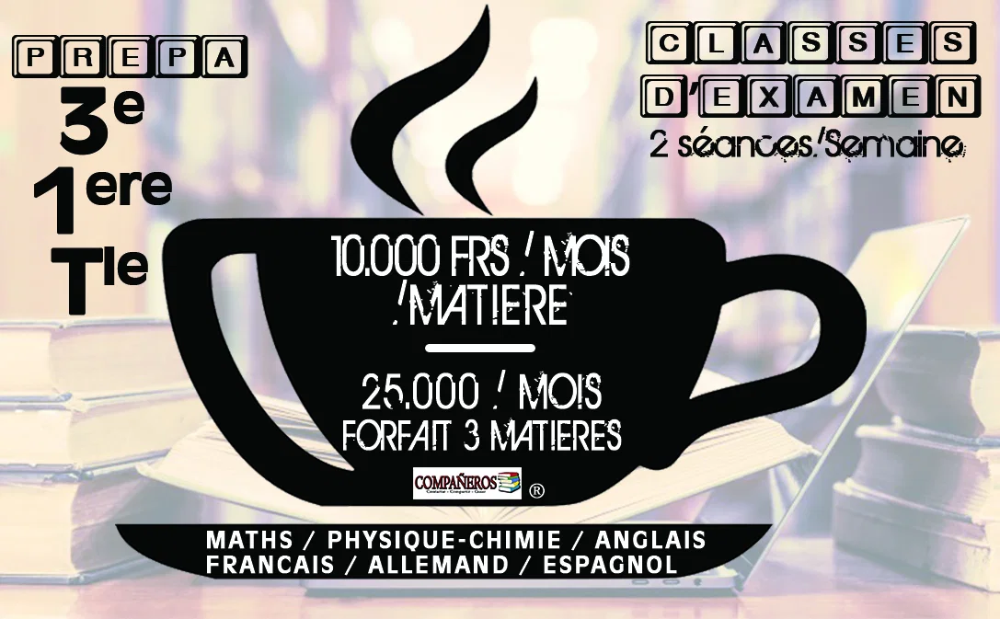
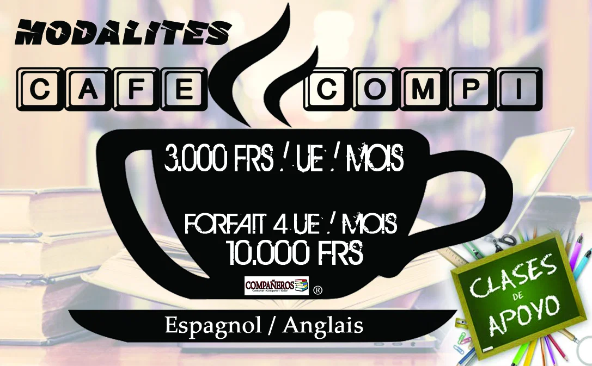
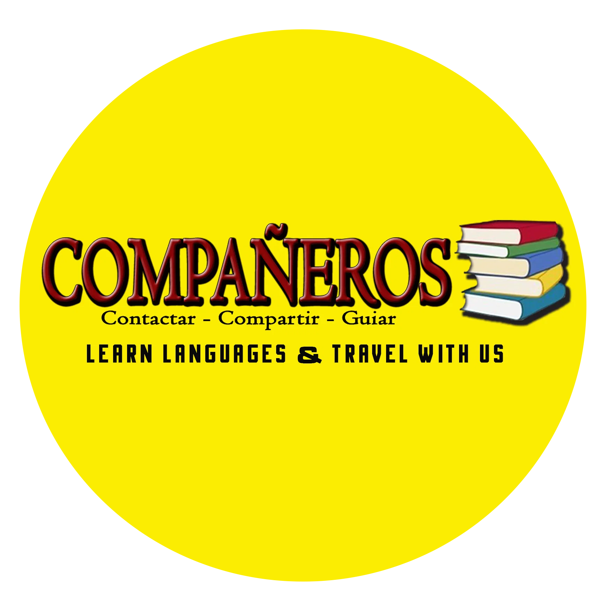
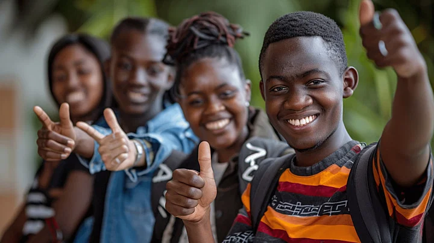
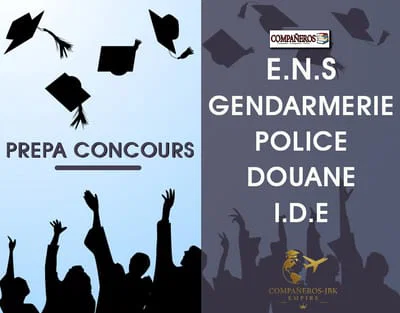

# COURS DE SOUTIEN - Compañeros-Jbk Empire

Source: https://686343fd3dffb.site123.me/services-compa%C3%91eros/cours-de-soutien

Description: Voici les différentes matières que nous proposons en cours de soutien pour les classes d'examen et étudiants!

## Structure de contenu

## COURS DE SOUTIEN

## Textes utiles

- SERVICES COMPAÑEROS
- COURS DE SOUTIEN
- CLASSES D'EXAMEN
- Compañeros propose des cours de renforcement des capacités pour les élèves des classes d'examen. Les matières que nous proposons sont celles des épreuves obligatoires à hauts coefficients. Il s'agit également des épreuves où les élèves doivent beaucoup travailler pour éviter la note de 0/20 (zéro sur vingt). Les cours pour élèves, proposés par notre centre sont les suivants:
- * MATHS: Les mathématiques sont fondamentales pour les élèves en classes d'examen car elles développent des compétences essentielles, telles que la résolution de problèmes, l'esprit critique et participe à une meilleure compréhension des autres matières, sur le plan cognitif.
- * PHYSIQUE-CHIMIE: L'étude de la physique-chimie en classes d'examen est cruciale car elle fournit une base solide pour comprendre les lois fondamentales de la nature et les phénomènes qui nous entourent.
- * ANGLAIS: L'apprentissage de l'anglais est crucial pour les élèves des classes d'examen, car il ouvre des portes vers de nombreuses opportunités, tant sur le plan académique que professionnel.
- * FRANCAIS: Les élèves des classes d'examen étudier le français pour plusieurs raisons essentielles. En plus d'être une langue de communication principale pour l'élève, elle aide à mieux comprendre toutes les autres matières, du point de vue sémantique.
- * ALLEMAND: L’allemand est souvent appelé la bête noire pour la plupart des élèves de classes d’examen. D’où la nécessité de lui accorder beaucoup d’importance afin d’éviter la note éliminatoire à l’examen officiel.
- * ESPAGNOL: Bien qu’étant la matière de base pour plusieurs élèves, l’espagnol est une matière que ceux des classes d’examens doivent prendre très au sérieux. Car il arrive souvent à plusieurs d’entre eux, de se retrouver avec des notes peu sérieuses, à cause de quelques incompréhensions dues aux interférences linguistiques et autres phénomènes tels que les faux amis, les mauvaises interprétations du travail demandé etc.
- * SVT: Les élèves en classes d'examen doivent se renforcer en SVT (Sciences de la Vie et de la Terre) pour acquérir des connaissances fondamentales sur le monde. C'est en plus une matière à haut coefficient pour les séries scientifiques. Elle est comptée parmi les principales cause des échecs aux examens officiels.
- TARIFS DES COURS DE SOUTIEN
- Classes: 3 e / 1 re / T le
- 10.000 F.Cfa par mois pour chaque matière.
- Nombre minimal de matières à choisir: 01
- Forfait 3 matières: 25.000 Fcfa par mois Nombre de séances par semaine: 02 (09 séances par mois) pour chaque matière.
- Optimisez la chance pour votre enfant!
- ETUDIANTS D'ESPAGNOL & D'ANGLAIS
- Le secret pour ne pas avoir de rattrapage à faire pendant l’année universitaire est de suivre les différents cours de soutien, encore appelés Cafés. Ces cours sont destinés à soutenir l’étudiant sur le plan académique, et lui permettent de mieux comprendre les cours magistraux enregistrés à l’amphithéâtre. L’étudiant a la possibilité de choisir avec nous, uniquement l’Unité d’Enseignement qui lui pose des problèmes de compréhension. Il n’est pas obligé de suivre chez nous, les cours de soutien pour toutes les Unités proposées pendant les 2 semestres.
- NIVEAU I / NIVEAU 2 / NIVEAU 3
- 3.000 F.Cfa par mois pour chaque UE
- Nombre minimal d'UE à choisir: 01
- Forfait 3 UE: 10.000 Fcfa par mois
- Nombre de séances par semaine: 02 (09 séances par mois) pour chaque UE.
- Pas session de rattrapage pour cette année!
- +237-678 032 746 * 698 058 931 * 698 329 535
- jbkfilms2014@gmail.com
- https://www.google.com/search?client=firefox-b-d&q=companeros%2FJbkfilms+maps
- (Carrefour Cradat - Rue pavés 3744, en face de l'auto école Kassap)

## Images liées

Fichier: ./images/153-2000-68655b792f0a1-6250cf10.jpg

Fichier: ./images/149-normal-6867b8c65fefa-65ce9d77.jpg

Fichier: ./images/150-normal-6867ba3d90a5d-984ab6e5.jpg

Fichier: ./images/151-normal-6870a9fb259b1-b412df26.png

Fichier: ./images/152-800-68655b792f0a1-8ed3b507.jpg

Fichier: ./images/15-400-687a30a0db30b-e224f5c8.jpg

Fichier: ./images/32-400-686431bb817da-a01bf517.jpg

Fichier: ./images/33-400-68655cae0a55c-164bdb1c.jpg

## Liens et appels à l'action

- Compañeros-Jbk Empire: https://686343fd3dffb.site123.me/
- SERVICES COMPAÑEROS: https://686343fd3dffb.site123.me/services-compa%C3%91eros
- Cours de soutien: https://686343fd3dffb.site123.me/services-compa%C3%91eros/tag/cours-de-soutien
- BEPC: https://686343fd3dffb.site123.me/services-compa%C3%91eros/tag/bepc
- PROBATOIRE: https://686343fd3dffb.site123.me/services-compa%C3%91eros/tag/probatoire
- BACC: https://686343fd3dffb.site123.me/services-compa%C3%91eros/tag/bacc
- ANGLAIS: https://686343fd3dffb.site123.me/services-compa%C3%91eros/tag/anglais
- FRANCAIS: https://686343fd3dffb.site123.me/services-compa%C3%91eros/tag/francais
- ESPAGNOL: https://686343fd3dffb.site123.me/services-compa%C3%91eros/tag/espagnol
- PHYSIQUE: https://686343fd3dffb.site123.me/services-compa%C3%91eros/tag/physique
- CHIMIE: https://686343fd3dffb.site123.me/services-compa%C3%91eros/tag/chimie
- SCIENCES: https://686343fd3dffb.site123.me/services-compa%C3%91eros/tag/sciences
- cours de repetitions: https://686343fd3dffb.site123.me/services-compa%C3%91eros/tag/cours-de-repetitions
- Cours de: https://686343fd3dffb.site123.me/services-compa%C3%91eros/tag/cours-de
- SUIVIS DE VOYAGES: https://686343fd3dffb.site123.me/services-compa%C3%91eros/suivis-de-voyages
- PREPARATION CONCOURS: https://686343fd3dffb.site123.me/services-compa%C3%91eros/preparation-concours
- COURS DE LANGUES NATIONALES & INTERNATIONALES: https://686343fd3dffb.site123.me/services-compa%C3%91eros/cours-de-langues-nationales-internationales
- +237-678 032 746 * 698 058 931 * 698 329 535: https://wa.me/237678032746698058931698329535
- https://www.google.com/search?client=firefox-b-d&q=companeros%2FJbkfilms+maps: http://maps.google.com/?q=https%3A%2F%2Fwww.google.com%2Fsearch%3Fclient%3Dfirefox-b-d%26amp%3Bq%3Dcompaneros%252FJbkfilms%2Bmaps
- (Carrefour Cradat - Rue pavés 3744, en face de l'auto école Kassap): http://maps.google.com/?q=https%3A%2F%2Fwww.google.com%2Fsearch%3Fclient%3Dfirefox-b-d%26amp%3Bq%3Dcompaneros%252FJbkfilms%2Bmaps
